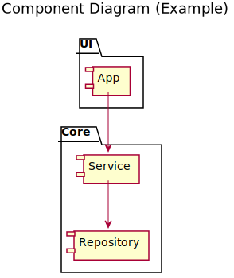
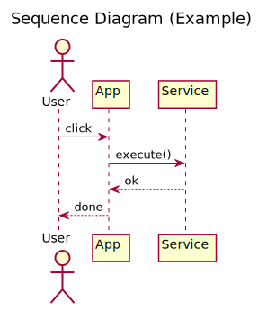

# PlantUML Template

Simple PlantUML examples for documentation.

## Diagrams

### Component Diagram

### Sequence Diagram

## How to use
- Write `.puml` files under `docs/uml/`
- Render them to SVG (locally or via GitHub Actions)
- Reference SVGs from documentation
